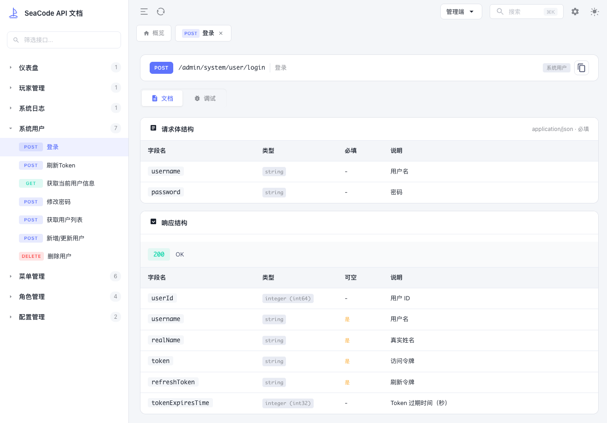
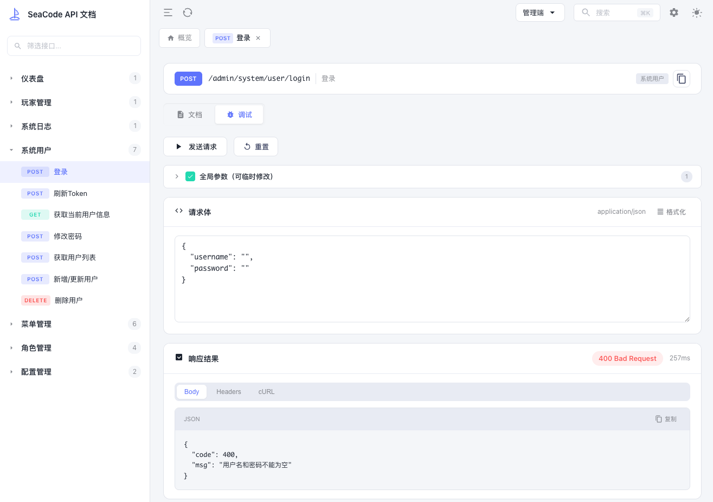
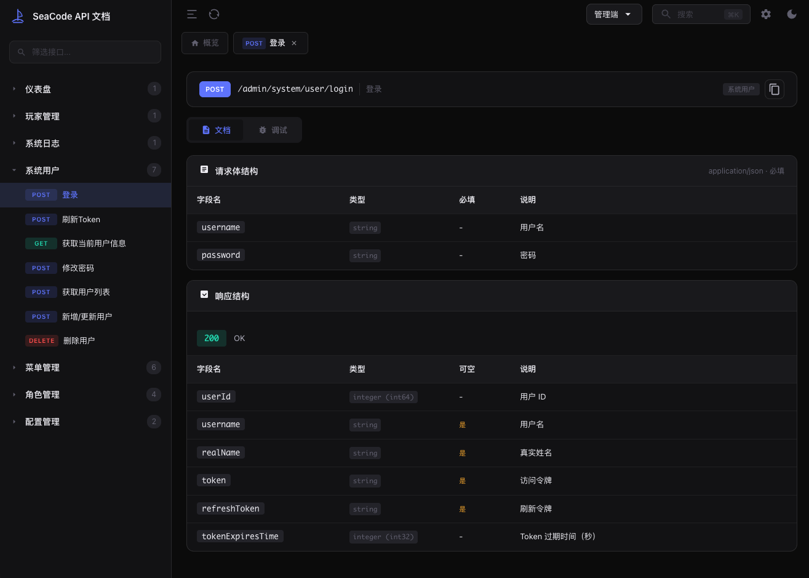

# 🎨 SwaggerSloop

<p align="center">
  
</p>

<p align="center">
  <strong>A beautiful Swagger UI skin for .NET and Java</strong><br>
  <strong>美观的 Swagger UI 皮肤，支持 .NET 和 Java</strong>
</p>

<p align="center">
  <a href="#-features--特性">Features</a> •
  <a href="#-installation--安装">Installation</a> •
  <a href="#-quick-start--快速开始">Quick Start</a> •
  <a href="#%EF%B8%8F-configuration--配置">Configuration</a> •
  <a href="#-license--许可证">License</a>
</p>

<p align="center">
  <a href="https://www.nuget.org/packages/SwaggerSloop"></a>
  <a href="https://central.sonatype.com/artifact/com.seacode/swagger-sloop-spring-boot-starter"></a>
  
  
  
</p>

<p align="center">
  <a href="#english">English</a> | <a href="#中文">中文</a>
</p>

---

## 📸 Screenshots / 截图

<p align="center">
  
</p>
<p align="center"><em>Documentation View / 文档视图</em></p>

<p align="center">
  
</p>
<p align="center"><em>Debug & Test View / 调试视图</em></p>

<p align="center">
  
</p>
<p align="center"><em>Dark Theme / 暗黑模式</em></p>

---

<a id="english"></a>

## English

### ✨ Features / 特性

| Feature                  | Description                                            |
| ------------------------ | ------------------------------------------------------ |
| 🎨 **Modern UI**         | Art-Design-Pro inspired design with OKLCH color system |
| 🌓 **Theme Switch**      | Light / Dark / Auto (follows system)                   |
| 🔍 **Global Search**     | Quick API search with `Ctrl+K`                         |
| 📋 **Code Copy**         | One-click copy for cURL, JS, C#, Java snippets         |
| 📑 **Multi-API Groups**  | Switch between multiple OpenAPI specs                  |
| 📱 **Responsive**        | Works on desktop, tablet, mobile                       |
| ⚡ **Zero Dependencies** | Pure vanilla JS/CSS                                    |
| 🌐 **Cross-Platform**    | .NET 6-10 and Java 8+ / Spring Boot 2.7+               |

### 📦 Installation / 安装

#### .NET

```bash
dotnet add package SwaggerSloop
```

#### Java (Maven)

```xml
<dependency>
    <groupId>com.seacode</groupId>
    <artifactId>swagger-sloop-spring-boot-starter</artifactId>
    <version>1.0.0</version>
</dependency>
```

#### Java (Gradle)

```groovy
implementation 'com.seacode:swagger-sloop-spring-boot-starter:1.0.0'
```

### 🚀 Quick Start / 快速开始

#### .NET

```csharp
var builder = WebApplication.CreateBuilder(args);
builder.Services.AddEndpointsApiExplorer();
builder.Services.AddSwaggerGen();

var app = builder.Build();
app.UseSwagger();
app.UseSwaggerSloop(); // 👈 Replace UseSwaggerUI()
app.Run();
```

#### Java (Spring Boot)

```properties
# application.properties
swagger-sloop.enabled=true
swagger-sloop.document-title=My API
```

Then visit: `http://localhost:8080/swagger/`

### ⚙️ Configuration / 配置

#### .NET

```csharp
app.UseSwaggerSloop(options =>
{
    options.DocumentTitle = "My API";
    options.RoutePrefix = "swagger";
    options.PrimaryColor = "#5D87FF";
    options.DefaultTheme = "auto"; // light, dark, auto
    options.EnableSearch = true;
    options.EnableCodeCopy = true;

    // Multi-group support
    options.SwaggerEndpoint("/swagger/v1/swagger.json", "API V1");
    options.SwaggerEndpoint("/swagger/v2/swagger.json", "API V2");
});
```

#### Java

```yaml
# application.yml
swagger-sloop:
  enabled: true
  document-title: My API
  route-prefix: swagger
  primary-color: "#5D87FF"
  default-theme: auto
  enable-search: true
  enable-code-copy: true
  swagger-endpoints:
    - url: /v3/api-docs
      name: API V1
```

### ⌨️ Keyboard Shortcuts

| Shortcut       | Action           |
| -------------- | ---------------- |
| `Ctrl/Cmd + K` | Open search      |
| `Escape`       | Close dialog     |
| `↑ / ↓`        | Navigate results |
| `Enter`        | Select result    |

---

<a id="中文"></a>

## 中文

### ✨ 特性

| 特性              | 说明                                         |
| ----------------- | -------------------------------------------- |
| 🎨 **现代化 UI**  | 基于 Art-Design-Pro 设计风格，OKLCH 色彩系统 |
| 🌓 **主题切换**   | 亮色 / 暗色 / 自动（跟随系统）               |
| 🔍 **全局搜索**   | `Ctrl+K` 快速搜索 API                        |
| 📋 **代码复制**   | 一键复制 cURL、JS、C#、Java 代码             |
| 📑 **多文档支持** | 支持多个 OpenAPI 文档切换                    |
| 📱 **响应式**     | 适配桌面、平板、手机                         |
| ⚡ **零依赖**     | 纯原生 JS/CSS                                |
| 🌐 **跨平台**     | 支持 .NET 6-10 和 Java 8+ / Spring Boot 2.7+ |

### 📦 安装

#### .NET

```bash
dotnet add package SwaggerSloop
```

#### Java (Maven)

```xml
<dependency>
    <groupId>com.seacode</groupId>
    <artifactId>swagger-sloop-spring-boot-starter</artifactId>
    <version>1.0.0</version>
</dependency>
```

### 🚀 快速开始

#### .NET

```csharp
var builder = WebApplication.CreateBuilder(args);
builder.Services.AddEndpointsApiExplorer();
builder.Services.AddSwaggerGen();

var app = builder.Build();
app.UseSwagger();
app.UseSwaggerSloop(); // 👈 替换 UseSwaggerUI()
app.Run();
```

#### Java (Spring Boot)

```properties
# application.properties
swagger-sloop.enabled=true
swagger-sloop.document-title=我的 API
```

然后访问：`http://localhost:8080/swagger/`

### ⚙️ 配置项

| 配置项   | .NET                | Java                | 默认值              | 说明            |
| -------- | ------------------- | ------------------- | ------------------- | --------------- |
| 文档标题 | `DocumentTitle`     | `document-title`    | "API Documentation" | 页面标题        |
| 路由前缀 | `RoutePrefix`       | `route-prefix`      | "swagger"           | URL 路径        |
| 主题色   | `PrimaryColor`      | `primary-color`     | "#5D87FF"           | 主题颜色        |
| 默认主题 | `DefaultTheme`      | `default-theme`     | "auto"              | light/dark/auto |
| 搜索功能 | `EnableSearch`      | `enable-search`     | true                | 启用搜索        |
| 代码复制 | `EnableCodeCopy`    | `enable-code-copy`  | true                | 启用复制        |
| 多分组   | `SwaggerEndpoint()` | `swagger-endpoints` | -                   | 配置多个API分组 |

### ⌨️ 快捷键

| 快捷键         | 功能       |
| -------------- | ---------- |
| `Ctrl/Cmd + K` | 打开搜索   |
| `Escape`       | 关闭对话框 |
| `↑ / ↓`        | 导航结果   |
| `Enter`        | 选择结果   |

---

## 📁 Project Structure / 项目结构

```
SwaggerSloop/
├── dotnet/                              # .NET 实现
│   ├── src/SwaggerSloop/                # 主库
│   └── samples/SwaggerSloop.Sample/     # 示例
├── java/                                # Java 实现
│   ├── swagger-sloop-spring-boot-starter/  # Spring Boot Starter
│   └── samples/swagger-sloop-sample/    # 示例
└── shared/resources/                    # 共享前端资源
```

## 📄 License / 许可证

[MIT License](LICENSE)

## 🙏 Credits / 致谢

- UI inspired by [Art-Design-Pro](https://github.com/Daymychen/art-design-pro)

---

<p align="center">
  Made with ❤️ by <a href="https://github.com/seacode">SeaCode</a>
</p>
